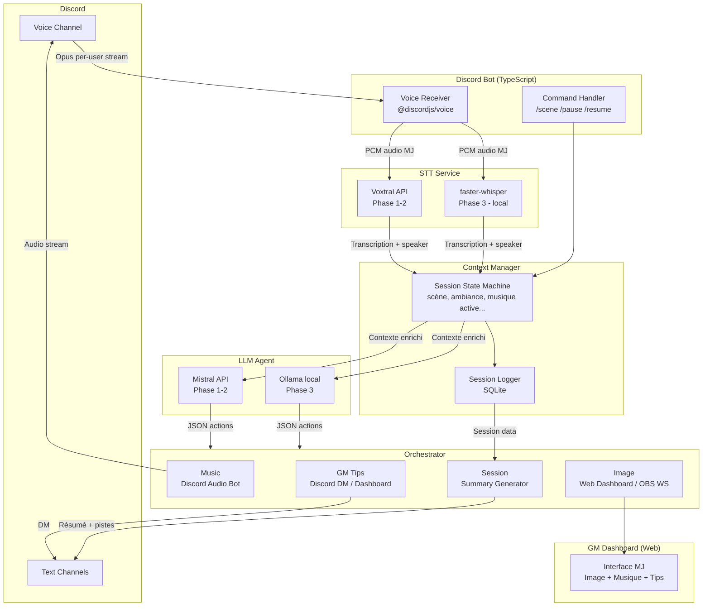

# RPG-Assistant

> Un assistant IA temps-réel pour les sessions de jeu de rôle, intégré à Discord.

---

## Vision

RPG-Assistant transforme une session de JdR en une expérience immersive augmentée par l'IA :

- **Transcription vocale** en direct (priorité au Maître du Jeu)
- **Agent de décision contextuel** qui réagit à la narration (musique, images, conseils MJ)
- **Orchestrateur** qui exécute les actions sur Discord, OBS, et un dashboard web
- **Journaliste de campagne** : résumés automatiques, préparation des prochaines séances

---

## Analyse & Challenges

### ⚠️ Capture audio système (VB-Cable) : à éviter dès le MVP

La capture audio système est séduisante par sa simplicité, mais elle a des défauts critiques pour ce projet :

| Problème | Impact |
|---|---|
| Pas d'identification des locuteurs | Impossible de distinguer le MJ des joueurs |
| Capture tout le son système | Notifications, musique, effets sonores polluent la transcription |
| Windows-only | Pas portable |
| Latence introduite par VB-Cable | Dégradation qualité audio |

**Recommandation** : Partir directement sur le **bot Discord listener** avec `discord.js` + `@discordjs/voice`. Il fournit un flux audio **par utilisateur** (Opus), c'est la base de tout le reste (diarisation, attribution des dialogues, filtrage par rôle).

C'est légèrement plus complexe au setup, mais c'est la fondation correcte. Ajouter la diarisation après-coup sur un flux mono est un problème exponentiellement plus difficile.

### ⚠️ Polling 5-15s : insuffisant pour les moments dramatiques

Un polling pur toujours actif génère du bruit et rate les moments clés. Proposition d'une **approche hybride** :

- **Polling léger** (15s) pour maintenir le contexte ambiant à jour
- **Triggers événementiels** sur mots-clés/phrases détectés dans la transcription (combat, révélation, danger, etc.)
- **Trigger manuel** via commande Discord (`/scene combat`) pour les moments planifiés

### ⚠️ Génération d'images AI pour les scènes : à déprioritiser

Générer une image en temps réel (Stable Diffusion, DALL-E) prend 5-30 secondes et produit des résultats stylistiquement incohérents entre les scènes. Pour une atmosphère RPG, la cohérence visuelle est plus importante que la nouveauté.

**Recommandation** : Bibliothèque d'assets curatée + **recherche sémantique locale** (sentence-transformers ou équivalent TS). L'agent sélectionne l'image la plus pertinente plutôt que d'en générer une. La génération peut être ajoutée en Phase 3 pour enrichir la bibliothèque.

### ⚠️ Considérations légales et éthiques

Enregistrer des conversations vocales Discord implique :
- L'**accord explicite** de tous les participants avant chaque session
- Afficher clairement dans le canal quand l'enregistrement est actif (statut bot)
- Ne jamais stocker les flux audio bruts au-delà du nécessaire (transcrire, supprimer)

### ✅ Voxtral : bon choix de départ

Mistral Voxtral (sorti en 2025) est un excellent choix pour démarrer via API. Points d'attention :
- Vérifier la disponibilité et latence de l'endpoint **streaming/realtime** au moment du dev
- Avoir un fallback préparé : **Whisper via API OpenAI** ou **faster-whisper en local** (Python microservice léger)
- Whisper fonctionnant hors-ligne, c'est le candidat naturel pour la Phase 3 locale

---

## Décision Technologique : TypeScript ✅

Python est over-représenté dans les tutoriels IA, mais pour **ce projet spécifique**, TypeScript est le bon choix :

| Critère | TypeScript | Python |
|---|---|---|
| Discord integration | `discord.js` = gold standard, mature, typé | `discord.py` = bon mais moins actif |
| Bot vocal Discord | `@discordjs/voice` = natif et documenté | Complexe, moins stable |
| Orchestration / web | Node.js natif, très performant | Nécessite Flask/FastAPI en plus |
| LLM API calls | `fetch` natif ou `axios`, SDK Mistral TS | Excellent aussi |
| **LLM local (Ollama)** | **API REST → compatible TS nativement** | Légèrement plus d'écosystème |
| STT local (Whisper) | `whisper.cpp` a des bindings Node | Plus naturel en Python |
| ML/Embeddings | Limité (pas de PyTorch) | Excellent |

**Conclusion** : TypeScript pour l'ensemble du projet. Si un besoin de ML local spécifique émerge (embeddings, Whisper), le résoudre via un **microservice Python léger** exposé en REST, appelé depuis le codebase TS. Ollama (LLM local) expose déjà une API REST — aucune friction.

---

## Architecture Proposée



### Format JSON de l'agent (étendu)

```json
{
  "scene": "exploration",
  "mood": "mystérieux",
  "confidence": 0.87,
  "actions": [
    { "type": "music", "track": "forest_mystery", "fade_in": 3 },
    { "type": "image", "query": "ruines dans une forêt sombre", "source": "library" },
    { "type": "gm_tip", "text": "Préparer un jet de Perception. DC 14.", "priority": "high" },
    { "type": "rule_help", "topic": "stealth", "system": "D&D5e" }
  ],
  "trigger": "polling",
  "timestamp": "2025-10-15T20:34:11Z"
}
```

---

## Roadmap

### Phase 0 — Fondations ✅
- [x] Analyse architecture & décisions techniques documentées
- [x] Monorepo pnpm workspaces (apps/, packages/, services/)
- [x] TypeScript strict, tsconfig partagé
- [x] `packages/shared-types` — types partagés (AudioSegment, Session, AgentResponse…)
- [ ] Linting (ESLint), formatting (Prettier), CI GitHub Actions

### Phase 1 — MVP : Capture → STT → Agent → Dashboard 🚧 En cours

**Objectif** : Une session complète fonctionne, même imparfaitement.

- [x] Bot Discord rejoint le vocal, reçoit l'audio par utilisateur
- [x] Pipeline audio : Opus → PCM 48kHz stéréo → 16kHz mono WAV
- [x] Commandes slash : `/session start`, `/session stop`, `/session status`
- [x] Notice de consentement automatique dans le canal texte
- [x] Reconnexion automatique en cas de déconnexion vocale
- [x] `AUDIO_OUTPUT_MODE` — choix entre sauvegarde locale des `.wav` (dev) et hook STT (Phase 1+)
- [ ] `packages/stt-client` — appel Voxtral API avec le WAV bufferisé
- [ ] `packages/context-manager` — state machine (scène, ambiance, historique)
- [ ] `packages/llm-agent` — appel Mistral API → JSON actions validé par Zod
- [ ] `apps/orchestrator` — dispatch des actions JSON
- [ ] `apps/gm-dashboard` — interface web MJ (React + Vite)
- [ ] Logger de session (SQLite via `better-sqlite3`)

### Phase 2 — Robustesse & Enrichissement

- [ ] Triggers événementiels sur mots-clés dans la transcription
- [ ] Commandes Discord enrichies (`/scene`, `/mood`, `/recap`)
- [ ] Intégration OBS WebSocket (`obs-websocket-js`) pour l'affichage de scène
- [ ] `apps/session-summarizer` — résumés automatiques post-session
- [ ] Tests d'intégration (STT client mocké, LLM agent mocké)

### Phase 3 — Full Local

- [ ] `services/whisper-local` — microservice Python faster-whisper (REST)
- [ ] LLM local via Ollama (compatible sans changer le code agent)
- [ ] Recherche sémantique dans la bibliothèque d'assets
- [ ] Génération d'images asynchrone (enrichissement bibliothèque)

---

## Structure du Projet

```
rpg-assistant/
├── apps/
│   ├── discord-bot/          ✅ Bot Discord — capture vocale + slash commands
│   ├── orchestrator/         🔜 Réception JSON, dispatch des actions
│   ├── gm-dashboard/         🔜 Interface web MJ (React + Vite)
│   └── session-summarizer/   🔜 Résumés post-session
├── packages/
│   ├── shared-types/         ✅ Types partagés (AudioSegment, Session, AgentResponse…)
│   ├── stt-client/           🔜 Abstraction STT (Voxtral API → Whisper local)
│   ├── llm-agent/            🔜 Abstraction LLM (Mistral API → Ollama)
│   ├── context-manager/      🔜 State machine de session
│   └── asset-library/        🔜 Musique/images + recherche sémantique
├── services/
│   └── whisper-local/        🔜 Microservice Python faster-whisper (Phase 3)
├── assets/
│   ├── music/
│   └── images/
├── .github/
│   └── copilot-instructions.md
├── pnpm-workspace.yaml
├── tsconfig.base.json
├── .env.example
└── README.md
```

### Pipeline audio implémenté (`apps/discord-bot`)

```
Discord Opus (48 kHz stéréo, 20 ms/frame)
  ↓ prism.opus.Decoder
PCM 48 kHz stéréo 16-bit
  ↓ stereoToMono()
PCM 48 kHz mono
  ↓ downsample(÷3)
PCM 16 kHz mono               ← format cible Voxtral / Whisper
  ↓ pcmToWav()
AudioSegment.wavBuffer        ← prêt pour l'appel STT
```

---

## Stack Technique

| Composant | Technologie | Notes |
|---|---|---|
| Language principal | TypeScript 5+ | Strict mode |
| Package manager | pnpm workspaces | Monorepo |
| Discord bot | discord.js v14 + @discordjs/voice | |
| STT Phase 1-2 | Voxtral API (Mistral) | Fallback: Whisper API OpenAI |
| STT Phase 3 | faster-whisper (Python µservice) | REST interne |
| LLM Phase 1-2 | Mistral API | mistral-large ou mistral-small |
| LLM Phase 3 | Ollama (llama3, mistral local) | API REST nativement compatible |
| Base de données | SQLite (better-sqlite3) | Sessions, logs |
| Dashboard | React + Vite | Affiché sur le poste MJ |
| OBS Integration | obs-websocket-js | Affichage scènes |
| Tests | Vitest | |
| CI | GitHub Actions | |

---

## Démarrage Rapide

### Prérequis

- **Node.js** ≥ 20 ([nodejs.org](https://nodejs.org))
- **pnpm** ≥ 9 — `npm install -g pnpm`
- Un **serveur Discord** où vous avez les droits d'admin
- Un compte [Discord Developer Portal](https://discord.com/developers/applications)

### 1. Installation

```bash
git clone https://github.com/your-handle/rpg-assistant
cd rpg-assistant
pnpm install
```

### 2. Créer l'application Discord

1. Aller sur [discord.com/developers/applications](https://discord.com/developers/applications) → **New Application**
2. Onglet **Bot** → **Reset Token** → copier le token
3. Onglet **Bot** → activer les **Privileged Gateway Intents** :
   - ✅ Server Members Intent
   - ✅ Message Content Intent *(si commandes texte futures)*
4. Onglet **OAuth2 → URL Generator** → scopes : `bot`, `applications.commands`
5. Permissions bot : `Connect`, `Speak`, `Send Messages`, `Read Message History`
6. Copier l'URL générée → inviter le bot sur votre serveur

### 3. Configuration

```bash
cp .env.example .env
```

Remplir `.env` :

```env
DISCORD_TOKEN=<token copié à l'étape 2>
DISCORD_CLIENT_ID=<Application ID, onglet General Information>
DISCORD_GUILD_ID=<ID de votre serveur — clic droit sur le serveur → Copier l'identifiant>

# Sortie audio — 'local' pour sauvegarder les .wav (dev), 'stt' pour le hook STT (Phase 1+)
AUDIO_OUTPUT_MODE=local
RECORDINGS_DIR=./recordings
```

| Variable | Valeurs | Description |
|---|---|---|
| `AUDIO_OUTPUT_MODE` | `local` / `stt` | `local` : enregistre les WAV sur disque (debug uniquement). `stt` : route vers le hook STT (`packages/stt-client`). |
| `RECORDINGS_DIR` | chemin relatif ou absolu | Répertoire de destination quand `AUDIO_OUTPUT_MODE=local`. Défaut : `./recordings`. |

> ⚠️ `AUDIO_OUTPUT_MODE=local` persiste l'audio brut sur disque. Ne jamais utiliser en production.

> **Activer le mode développeur Discord** : Paramètres → Avancés → Mode développeur

### 4. Lancer le bot

```bash
pnpm dev:bot
```

Sortie attendue :
```
🔄 Registering slash commands...
✅ Slash commands registered.
✅ Bot ready — logged in as RPG-Assistant#1234
```

### 5. Utiliser le bot

Dans votre serveur Discord :

| Commande | Description |
|---|---|
| `/session start channel:#vocal gm:@alice` | Rejoindre le vocal, démarrer la capture |
| `/session stop` | Arrêter la capture et quitter le vocal |
| `/session status` | Afficher la session en cours |

Lors du `/session start`, le bot :
1. Affiche une **notice de consentement** dans le canal texte
2. Rejoint le salon vocal
3. Commence à capturer l'audio de **chaque utilisateur séparément**

Dans la console, chaque prise de parole apparaît :

**Avec `AUDIO_OUTPUT_MODE=local` :**
```
🎤 [Alice 👑 MJ] 2026-06-20 20:34:11 | 3.20s | 102.4 KB WAV
💾 [Alice 👑 MJ] 2026-06-20T20-34-11_Alice.wav — 3.20s, 102.4 KB
🎤 [Bob]         2026-06-20 20:34:15 | 1.50s |  48.0 KB WAV
💾 [Bob]         2026-06-20T20-34-15_Bob.wav — 1.50s, 48.0 KB
```
Les fichiers sont organisés dans `recordings/<sessionId>/`.

**Avec `AUDIO_OUTPUT_MODE=stt` :**
```
🎤 [Alice 👑 MJ] 2026-06-20 20:34:11 | 3.20s | 102.4 KB WAV
🔌 [STT hook] [Alice 👑 MJ] 3.20s, 102.4 KB — en attente d'intégration packages/stt-client
```

> Le dispatch audio est géré dans `apps/discord-bot/src/audio-output.ts`. Remplacer le corps de la fonction `logSttStub()` par un appel à `sttClient.transcribe()` une fois `packages/stt-client` implémenté.

---

## Contribuer

Ce projet est développé en solo pour l'instant. Les issues et suggestions sont bienvenues.

Voir [.github/copilot-instructions.md](.github/copilot-instructions.md) pour les conventions de développement.
